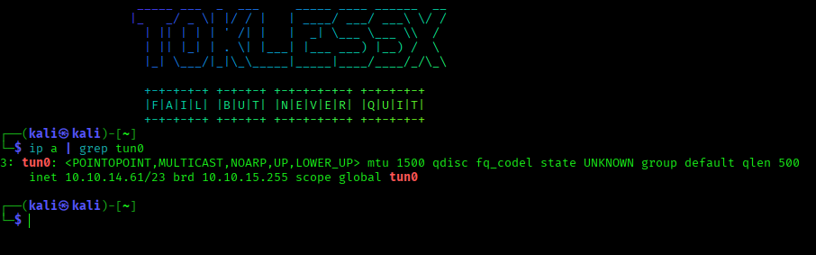
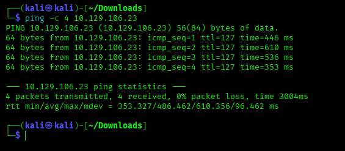
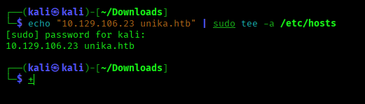
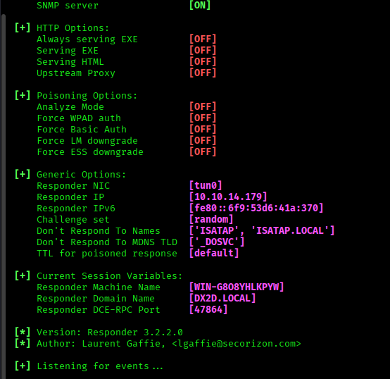
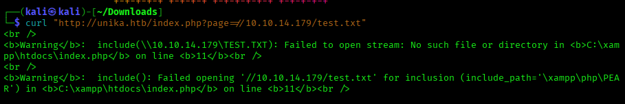
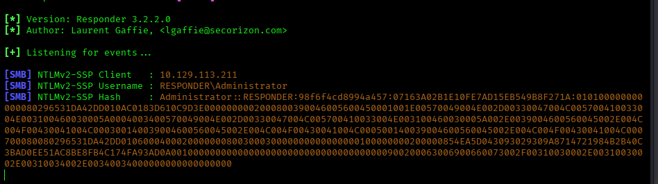
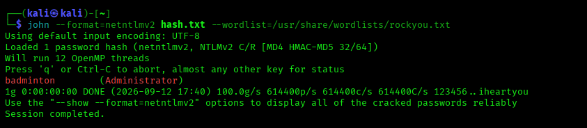
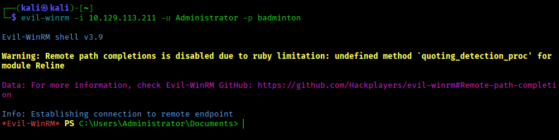
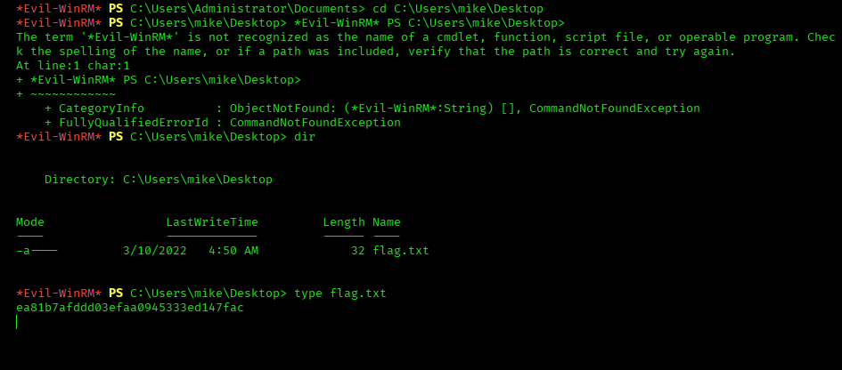

# Responder - Hack The Box Walkthrough

## 📌 Machine Information

| Detail | Value |
|--------|-------|
| **Name** | Responder |
| **Difficulty** | Very Easy |
| **Target OS** | Windows |
| **Attacker OS** | Kali Linux |
| **Platform** | Hack The Box |
| **Skills** | RFI, NTLM Hash Capture, Password Cracking, WinRM |

## 🎯 Objective

Capture the flag from the Responder machine by exploiting an RFI vulnerability, capturing an NTLM hash with Responder, cracking the password, and accessing the machine via WinRM.

## 🛠️ Tools Used

| Tool | Purpose |
|------|---------|
| **OpenVPN** | Connect to HTB network |
| **Responder** | Capture NTLM hashes |
| **John the Ripper** | Crack NTLMv2 hashes |
| **Evil-WinRM** | Remote Windows management |
| **curl** | Trigger RFI vulnerability |

## 📸 Walkthrough

### 1. VPN Connection
Connected to the HTB Machines network using OpenVPN.

---

### 2. Target Reconnaissance
Verified target reachability with ping.

---

### 3. Hosts File Configuration
Added `unika.htb` to `/etc/hosts`.

---

### 4. Responder Setup
Started Responder to capture NTLM hashes on `tun0`.

---

### 5. RFI Exploitation
Triggered the RFI vulnerability to force SMB authentication.

---

### 6. NTLM Hash Capture
Responder captured the NTLMv2 hash of the Administrator account.

---

### 7. Password Cracking
Cracked the hash with John the Ripper.

---

### 8. WinRM Access
Connected to the target via Evil-WinRM.

---

### 9. Flag Retrieval
Retrieved the flag from Mike's desktop.

---

## 📊 Attack Chain

HTB VPN (10.10.14.61)
↓
Target (10.129.106.23)
↓
RFI Vulnerability (//10.10.14.179/test.txt)
↓
SMB Connection to Attacker
↓
NTLM Hash Captured by Responder
↓
Hash Cracked with John (badminton)
↓
WinRM Access as Administrator
↓
Flag: ea81b7afddd03efaa0945333ed147fac

## 🏆 Flag

ea81b7afddd03efaa0945333ed147fac

## 📄 Full Documentation

- **PDF Report:** [Responder-HTB-Walkthrough.pdf](Responder-HTB-Walkthrough.pdf)
- **Editable DOCX:** [Responder-HTB-Walkthrough.docx](Responder-HTB-Walkthrough.docx)

Documented in LibreOffice Writer on Kali Linux.

## 🛡️ Key Takeaways

- RFI vulnerabilities can force servers to authenticate to attacker-controlled resources
- NTLM hashes can be captured and cracked offline
- Weak passwords are easily compromised
- WinRM provides remote access when credentials are obtained

## ⚠️ Disclaimer

This walkthrough is for **educational purposes only**. All testing was performed on Hack The Box, a legal penetration testing platform. Never test systems without explicit authorization.

## 📚 References

- [Hack The Box](https://www.hackthebox.com/)
- [Responder Tool](https://github.com/lgandx/Responder)
- [John the Ripper](https://www.openwall.com/john/)
- [Evil-WinRM](https://github.com/Hackplayers/evil-winrm)

